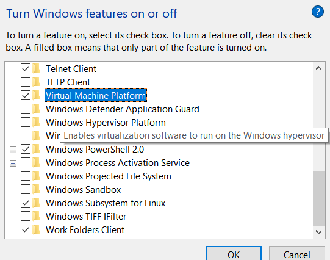

# Windows WSL Instructions

## Step 1.  Install WSL 2 and Ubuntu 20.04

1. Follow either the written instructions or video tutorial below to install WSL2. &#x20;
2. During this process, select "Ubuntu 20.04" as your Linux version.
3. See our overview below for a summary with screenshots.

**Written Instructions:**\
****[https://docs.microsoft.com/en-us/windows/wsl/install-win10](https://docs.microsoft.com/en-us/windows/wsl/install-win10)

**Video Tutorial:**\
[https://www.youtube.com/watch?v=D7Em1wjMiak](https://www.youtube.com/watch?v=D7Em1wjMiak) (commands in the description)

#### Our Summary of these Instructions:

1. Enable the Windows Subsystem for Linux
2. Ensure you meet the requirements for WSL2
3. Enable the Virtual Machine feature in Windows (see screenshot below)
4. Download the WSL2 update package
5. Set WSL2 as your default Linux system
6. Open Microsoft store, search for Ubuntu 20.04, and install it&#x20;
7. Launch the terminal and follow the prompt to create a new username/password (see screenshot below).

#### Screenshot: Enabling Virtual Machine feature in Windows:&#x20;




#### Screenshot: Running Ubuntu 20.04 in Windows for the first time:&#x20;


## Step 2.  Install NVM

_Note: Copy these commands and then paste into WSL2 by right-clicking on the terminal._

Enter the following commands into your Ubuntu terminal:

```
curl https://raw.githubusercontent.com/creationix/nvm/master/install.sh | bash  # Download and install
source ~/.profile  # Reload system environment
nvm install lts/erbium
```

## Step 3.  Editing Files in WSL2

In order to access your WSL2 file directory, run the following command in WSL2:

```
explorer.exe .
```

This will allow you to browse WSL2 as if it were another computer on a local network.


If you are using the WSL, you files for your experiment must be in the WSL, you can't use the WSL to run an experiment stored on the rest of your computer.


### Using code editors

Different [code editors](../../tips-and-tricks/code-editors.md) (such as VSCode) will have commands that you can run to open them in the current directory (e.g., `code .`). This helps make for a better coding experience in the WSL.

